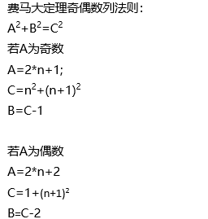

#  2018 中国大学生程序设计竞赛

???+ info "Contents"
    [TOC]

## A. Buy and Resell

题意：

给出 $n$ 个交易点，每次能够选择买或者卖，求获得最大利润。

思路：

维护两个优先队列，一个是卖，一个是替换，当价格差相同时，优先替换，因为次数要最少。

??? info "Code"
    ```cpp
    ---8<--
    online/2018-CCPC-Online/solutions/a.cpp
    ---8<--
    ```

## B. Congruence equation

留坑。

## C. Dream

题意：

给出一个 $p$，重定义加法和乘法，使得：

$$
(m + n)^p = m^p + n^p
$$

思路：

有费马小定理：$a^p \equiv a \pmod p$。

那只需要重定义：

$$
\begin{eqnarray*}
(m + n) &=& (m + n) \pmod p \\
(m \cdot n) &=& (m \cdot n) \pmod p
\end{eqnarray*}
$$

原根可以保证两个集合相等。

??? info "Code"
    ```cpp
    ---8<--
    online/2018-CCPC-Online/solutions/c.cpp
    ---8<--
    ```

## D. Find Integer

题意：

给出一个 $n$ 和一个 $a$。

找出：

$$
a^n + b^n = c^n
$$

思路：

* 根据费马大定理 $n \gt 2$ 无解。
* 显然 $n = 0$ 无解。
* $n = 1$，直接凑。

$n = 2$：

* 如果是奇数，有 $\displaystyle a^2 + (\frac{a \cdot a}{2})^2 = (\frac{(a \cdot a) + 1}{2}) ^2$。
* 如果是偶数，一直除下去，直到是奇数，然后把多余的偶数加到 $b$ 和 $c$ 上去。

或者：



??? info "Code"
    ```cpp
    ---8<--
    online/2018-CCPC-Online/solutions/d.cpp
    ---8<--
    ```

## E. GuGu Convolution

留坑。

## F. Neko and Inu

留坑。

## G. Neko's loop

题意：

给出一个长度为 $n$ 的数列，每个位置都有自己的权值，你有 $m$ 点能量，每次可以从 $i$ 走到 $(i+k) \bmod n$ 点，可以在任意时刻停止，为达到 $s$ 点能量，需要起始能量为多少。

思路：

可以通过 $\mathcal{O}(n)$ 的时间处理出循环节。

对于每个循环节，我们可以走完循环节或者不走完。

对于不走完这部分的步数可能为 $m \bmod \mbox{循环节长度}$，也可能为 $m$ 或者循环节长度。

问题就转换为长度不超过限制长度的最大连续子序列，通过 dp + 单调队列来解决。

??? info "Code"
    ```cpp
    ---8<--
    online/2018-CCPC-Online/solutions/g.cpp
    ---8<--
    ```

## H. Search for Answer

留坑。

## I. Tree and Permutation

题意：

一个序列的值为第一个点走到后面 $n-1$ 个点的距离和，求 $n!$ 个序列的和。

思路：

对于每条边，这条边的左右端点均要走向对方。

那么对于每条边的经过的次数为左右端点节点数的乘积。但是每个点都作为起点 $(n-1)!$ 次，求和即可得到答案。

??? info "Code"
    ```cpp
    ---8<--
    online/2018-CCPC-Online/solutions/i.cpp
    ---8<--
    ```

## J. YJJ's Salesman

题意：

给出若干个点，范围属于 $(0, 0) - (10^9, 10^9)$。

从 $(0, 0)$ 走到 $(10^9, 10^9)$，只能向上走，向右走，或者右上角走，有些点有权值，不能回头，求最后获得的最大权值。

思路：

最大上升子序列的权值和，先按 $x$ 排序，再对 $y$ 离散化，线段树优化。

??? info "Code"
    ```cpp
    ---8<--
    online/2018-CCPC-Online/solutions/j.cpp
    ---8<--
    ```
