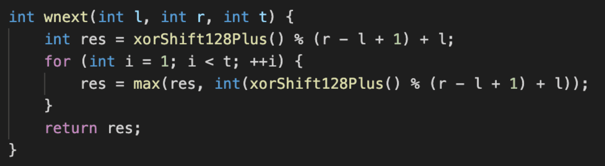
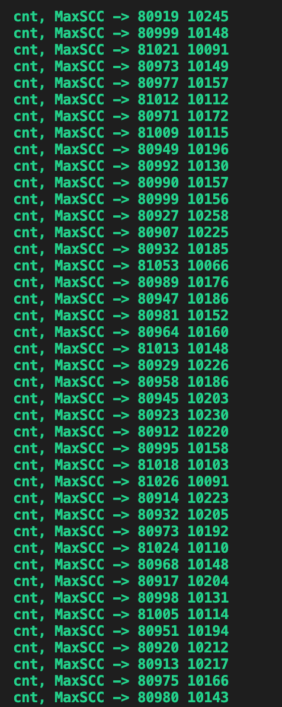

# The Hangzhou Normal U Qualification Trials for Zhejiang Provincial Collegiate Programming Contest 2020 Editorial

???+ info "Contents"
    [TOC]

## Our Sponsor

<center>

{ width="520"}

</center>

* 本场比赛由 DMI（数字媒体与人机交互）中心赞助。
* DMI 中心主要研究方向：
    * 智能视频编码：借助于深度学习技术，将其应用于视频编码中，提高压缩效率。
    * 图像质量增强：借助于机器学习，提高受损图像主客观质量或分辨率。
    * 视频编码算法优化：设计快速算法，在保证视频编码效率的同时提高编码速度。
* DMI 中心拥有：
    * 100 平米的实验室。
    * 20 台可进行深度学习的机器，2080TI 是标配。
* DMI 中心联系人：
    * 丁丹丹老师，浙江大学博士学位。
    * QQ: 187113186
    * Email: DandanDing@hznu.edu.cn

## Thanks

<center>


</center>

* 感谢所有验题人给我们提出的宝贵的意见。

## Talks

<center>


</center>

* 这个随机会不会被人打死。
* 果然「好题目是改出来的」，当你感觉良好的时候，总有验题人来给你当头棒喝，这里的「好」指的是题面阐述清楚，数据健壮，而非「好题」（逃。

## Materials

* [PRACTICE LINK](https://codeforces.com/gym/103463)

??? info "account"
    |    Handle    | Password |                      Name                       |
    | :----------: | :------: | :---------------------------------------------: |
    | team2950361  |  16PGIH  |     HZNU_kindergarten-C5-包敏、孙周毅、魏炜     |
    | team2950362  |  4R3PJ9  |   Fingertip melody-D3-谢作杰、卢霖统、杨昌林    |
    | team2950363  |  5I1SMD  |      HZNU_Tourists-A3-张凯莉、邱龙风、张传      |
    | team2950364  |  53BJ3G  |  Schroedinger's Pig-C1-朱湖健、陆家辉、梁文博   |
    | team2950365  |  6AERHL  |        Cabbage-B5-施骏炜、陈思欣、毛昱滢        |
    | team2950366  |  GVKNB4  |     Three Fruits-D5-温铭浩、魏依洋、李浩然      |
    | team2950367  |  XGFX11  |        pupil NB-C3-俞佳权、王凌言、钟恺         |
    | team2950368  |  UJVQEJ  | washing washing sleeping -D2-何陈聪、付俊、李骋 |
    | team2950369  |  UZHKAE  |  Kitten Marine Corp-A4-刘恒羽、叶初航、周婉婧   |
    | team29503610 |  IDM6ND  |     yingyingying-B4-邵铁夫、温声荣、苏桐渤      |
    | team29503611 |  ZEXXUY  |      O(n!) -> O(1)-C4-张枨、陈柯涛、吴陈宇      |
    | team29503612 |  YQ2QQH  |        acwork-A2-全振宇、宋博帆、王艺蓉         |
    | team29503613 |  GI9PXJ  |          NULL-B1-林峰、梁涵杰、徐光泽           |
    | team29503614 |  C82J2C  |        Turing-D4-陈雨欣、周珈伊、徐豪杰         |
    | team29503615 |  2S3CJB  |      play snake-B2-李彦庆、杨云龙、林泓佺       |
    | team29503616 |  2ZFGJA  |     Fried tomatoes-C2-毛潜飞、方一昊、叶俊      |
    | team29503617 |  H8ZIP2  |    dancing lightning-B3-徐浩然、梁雨欣、杨帆    |
    | team29503618 |  2R6WYC  |   non-prepared guys-A5-蔡林达、高笑芸、刘兴松   |

## Solutions

### A. A simple problem

#### 题意

给出 $0-n$ 的全排列，对于每个排列将每个数字串起来组成新的整数，问不含前导零且被 $m$ 整除有多少个数字

#### 思路

看数据范围经典状压 $dp$,$dp[S][i]$ 表示已经用了的数字状态为 $S$, 余数为 $i$ 的个数，每次枚举没用过的数字向下推即可（可参考大整数取余），当然注意 $10,11,12,13,14,15$ 都是两位数

??? info "Code"
    ```cpp
    ---8<--
    problem-set/The-Hangzhou-Normal-U-Qualification-Trials-for-ZJPSC-2020/Editorial/solutions/a.cpp
    ---8<--
    ```

### B. Hsueh- play balls

#### 题意

有 $n$ 个白球和 $m$ 个黑球在盒子里，每次从中取出一个球到盒子外，问取球过程中将所有球取出的过程中盒子外的球中，白球个数和黑球个数至少有一次相等的概率是多少？

#### 思路

答案是：

$$
\begin{eqnarray*}
\Large \frac{{n + m \choose n} - {n + m - 1 \choose n - 1} - {n + m - 1 \choose m - 1}}{{n + m \choose n}}
\end{eqnarray*}
$$

考虑此处概率就是 $\displaystyle \frac{\mbox{合法的方案数}}{\mbox{总方案数}}$。

总方案数显然是 $\displaystyle {n + m \choose n}$。

合法的方案数是什么，就是取球过程中白球个数和黑球个数至少有一次相等的方案，考虑反面，就是 $\mbox{总方案数} - \mbox{取球过程中白球个数和黑球个数一次都不相等的方案}$。

我们不妨令 $n \geq m$:

首先我们需要两条预备知识：

* 从 $(0, 0)$ 到 $(n, m)$ 的非降路径条数：$\displaystyle {n + m \choose n}$
* 从 $(s, t)$ 到 $(n, m)$ 的非降路径条数：$\displaystyle {n + m - s - t \choose n - s}$

那么我们转化一下，看成坐标系中，从 $(0, 0)$ 走到 $(n, m)$, 取白球看成向上走，取黑球看成向右走，那么任意时刻向上走的步数不能小于向右走的步数，即不经过 $y = x$（不包括 $(0, 0)$ 这个点）。

* 总的情况数为 $\displaystyle {n + m \choose n}$
* $(0, 0)$ 先向上走到 $(0, 1)$，那么到终点 $(n, m)$ 一定会经过 $y = x$ 这条直线，这种非法情况为 $(0, 1)$ 到 $(n, m)$ 的非降路径条数 $\displaystyle {n + m - 1 \choose n}$
* 从 $(0, 0)$ 向右走到 $(1, 0)$，这时候有两种情况，一种情况是合法的，另一种情况还是会经过 $y = x$，这时候记该路线一次经过 $y = x$ 的点为 $C$，将 $(1, 0)$ 到点 $C$ 间的路径关于 $y = x$ 对称，可以得到与情况 $2$ 的一一映射，即不合法情况的路径条数为 $\displaystyle {n + m - 1 \choose n}$
* 所以总的满足条件的路径条数为 $\displaystyle {n + m \choose n} - 2{n + m - 1 \choose n}$。
* 也可以直接考虑强制第一步往右走，那么总的方案数为 $\displaystyle {n + m - 1 \choose n - 1}$，再考虑上述的第三种情况的不合法方案数，那么不合法的有 $\displaystyle {n + m - 1 \choose n}$，所以合法方案数为 $\displaystyle {n + m - 1 \choose n - 1} - {n + m - 1 \choose n} = {n + m - 1 \choose n - 1} - {n + m - 1 \choose m - 1}$

??? info "Code"
    ```cpp
    ---8<--
    problem-set/The-Hangzhou-Normal-U-Qualification-Trials-for-ZJPSC-2020/Editorial/solutions/b.cpp
    ---8<--
    ```

### C. Hoogle Machine Translation

#### 题意

有一个翻译机器，每次能翻译若干个单词，但是返回的释义的顺序是混乱的，现在要求在 $25$ 次询问内，得出 $n(1 \leq n \leq 10^5)$ 个单词的释义。

#### 思路

##### 做法一

显然，需要用 $\log n$ 次询问解决问题。

那么我们对每个单词从 $1$ 到 $n$ 进行编号，那么我们在 $\log n$ 次询问中，在第 $i$ 次询问，对于 $1$ 到 $n$ 中的第 $j$ 个单词，如果 $j$ 在二进制表示下，第 $i$ 位上为 $1$，那么在这次询问中，我们就将这个单词加入询问列表。

最终，每个释义可以根据在询问中的出现情况，一一对应到一个单词。

??? info "Code"
    ```cpp
    ---8<--
    problem-set/The-Hangzhou-Normal-U-Qualification-Trials-for-ZJPSC-2020/Editorial/solutions/c.cpp
    ---8<--
    ```

##### 做法二

* 第一次询问所有的单词。
* 第二次将第一次询问的单词分成两半，继续询问，这个时候可以根据第一次和第二次询问的结果，将单词分成两半。
* 继续分下去即可。
* 咋一想，询问次数好像是 $\mathcal{O}(n \log n)$，但是我们对于每一层，并不需要分开询问，完全可以放在一起询问，因为哪些释义属于那一堆都已经知道了，那完全可以把每一层的询问放在一个询问里。这样询问的次数其实就是层数了，那显然就是 $\mathcal{O}(\log n)$。
* 但是后来一想，第 $2$ 次询问后，而且要分开询问，才能将第一次询问的所有释义分成两半，第 $3$ 次询问也要分开两次才能将第 $2$ 次的释义分成两部分。
* 所以次数好像要乘个 $2$，这样的话，$25$ 次询问次数，就有点不够了。

### D. Dup4 and pebble pile

#### 题意

有一些鹅卵石，编号为 $a$ 到 $b$，刚开始每个鹅卵石各自属于一堆。

接下来，每次可以选择两个属于不同堆的鹅卵石 $x$ 和 $y$，如果 $x$ 和 $y$ 有公共质因数 $t$ 并且 $t \geq p$，那么合并 $x$ 和 $y$ 所在的两堆鹅卵石。

问直到不能再合并为止，最终有多少堆鹅卵石。

$1 \leq a \leq b \leq 10^5, 2 \leq p \leq b$。

#### 思路

##### 做法一

可以对每个大于等于 $p$ 的质因数建一个虚点，然后 $a$ 到 $b$ 中的每个鹅卵石，向它自己本身大于等于 $p$ 的质因数所对应的那个虚点连边即可。

最终答案是联通块个数。

##### 做法二

直接枚举大于等于 $p$ 的质因数，然后枚举质因数的倍数，这些质因数的倍数之间相邻两个之间连边即可。

最终答案是联通块个数。

时间复杂度 $\mathcal{O}(n \alpha(n) \log n)$

??? info "Code"
    ```cpp
    ---8<--
    problem-set/The-Hangzhou-Normal-U-Qualification-Trials-for-ZJPSC-2020/Editorial/solutions/d.cpp
    ---8<--
    ```

### E. The King of Sum Xor

#### 题意

长度为 $n$ 的数组满足和为 $S$, 异或和为 $X$。

将满足这种情况的数组的最大值定义为 $M$, 然后将所有每组最大值最小的数组定集合义为 $V$, 问 $V$ 中数组长度最小为多少。

#### 思路

首先考虑 $S, \; X$ 的关系发现 $S = X + 2A \& B$，那么很显然构造出长度为 3 的数组满足这种关系，三个元素分别为 $\displaystyle X, \frac{S-X}{2}, \frac{S-X}{2}$ 同时这时候可以发现 `impossible` 的情况

* $S < X$
* $S - X$ 为奇数

我们将这三个数按照二进制分解将会得到一个出事情况的 $b$ 数组，$b_i$ 表示 $i$ 位有多少个 $1$

为了满足关系，我们每次执行以下操作

* $b_i = b_i-2,b_{i-1}=b_{i-1}+4$

接下来考虑最小的 $M$，可以很显然的发现是 $X$ 中二进制位最高的那一位或者是 $1$

然后我们就可以解决这个问题

首先二分一个 $n$，然后将这 $n$ 个数字分为等于 $M$ 和小于 $M$ 的两种数字，等于 $M$ 的数字很显然是只有一位为 $1$，小于 $M$ 的数字比 $M$ 那位二进制小的二进制位上随便放，而将这 $n$ 个数字分为等于 $M$ 和小于 $M$ 的两种数字，需要 $O(n)$ 的复杂度，也就是说我们现在的复杂度为 $60 \cdot O(n)$。

考虑如何优化这个复杂度

我们可以发现初始状态中 $b_i$ 最多为 $3$，而执行一次操作就会导致某一位 $1$ 的个数 $>=4$，那很显然小于 $M$ 的数字我们最多需要 $3$ 个，也就是小于 $M$ 那一位二进制位的最大 $b_i$，这时候就可以以 $O(60)$ 的复杂度计算，就可以很优美的解决这个问题

PS: 懒得改 std，就放了个 $\mathcal{O}(\log n \cdot \log (2^{60} - 1))$ 的复杂度版本

??? info "Code"
    ```cpp
    ---8<--
    problem-set/The-Hangzhou-Normal-U-Qualification-Trials-for-ZJPSC-2020/Editorial/solutions/e.cpp
    ---8<--
    ```

### F. Hsueh- Love Matrix

#### 题意

给出一个 $n \cdot m$ 的矩阵，其中矩阵元素 $a_{i, j} = i \cdot j$。询问矩阵中第 $k$ 大的元素是多少。

$1 \leq n, m \leq 10^9, 1 \leq k \leq n \cdot m$。

#### 思路

求第 $k$ 大的元素等价于求第 $n \cdot m - k + 1$ 小的元素。

那么我们二分答案 $x$，统计小于等于 $x$ 的元素有多少个。

那么这个计数，其实等价于求：

$$
\sum\limits_{i = 1}^n \min(m,  \lfloor \frac{x}{i} \rfloor)
$$

那么这个东西用数论分块，就可以在 $\mathcal{O}(\sqrt{x})$ 的时间复杂度下完成。

??? info "Code"
    ```cpp
    ---8<--
    problem-set/The-Hangzhou-Normal-U-Qualification-Trials-for-ZJPSC-2020/Editorial/solutions/f.cpp
    ---8<--
    ```

### G. LTS owns large quantities of apples

#### 题意

有 $n$ 个苹果，$m$ 个孩子。

* 第一个孩子拿到了 $n$ 个苹果，他吃掉了一下，发现剩下的苹果能恰好分成 $x$ 堆，他拿走了一堆，将剩下的 $(x - 1)$ 堆给第二个孩子。
* 第二个孩子拿到了 $\displaystyle \frac{(n - 1)(x - 1)}{x}$ 个苹果，吃掉了一个，发现剩下的苹果能恰好分成 $x$ 堆，他拿走了一堆，将剩下的 $(x - 1)$ 堆给第三个孩子。
* $\cdots$
* 第 $i$ 个孩子拿到了第 $(i - 1)$ 个孩子给他的苹果，吃掉了一个，发现剩下的苹果能恰好分成 $x$ 堆，拿走了一堆，将剩下的 $(x - 1)$ 堆给第 $(i + 1)$ 个孩子。
* $\cdots$
* 最后一个孩子拿到了倒数第二个孩子给他的苹果，吃掉了一个，发现剩下的苹果能恰好分成 $x$ 堆，拿走了一堆，然后留下了 $(x - 1)$ 堆，就离开了。

现在给出 $m(1 \leq m \leq 15), x(2 \leq x \leq 15)$，要求给出一个小于等于 $10^{18}$ 的合法的一个 $n$。

#### 思路

一个合法的解是：

$$
x^m - (x - 1)
$$

但是 $x = 2$ 的时候 和 $m = 1$ 的时候要特判一下。

我们考虑 $f(i)$ 表示第 $i$ 个小朋友拿到的苹果数量，那么有：

$$
\begin{eqnarray*}
f(1) &=& x^m - x + 1 = x^m - (x - 1)\\
f(2) &=& x^m - x^{m - 1} - (x - 1) = x^{m - 1}(x - 1) - (x - 1)\\
f(3) &=& x^m - 2x^{m - 1} + x^{m - 2} - (x - 1) = x^{m - 2}(x - 1)^2 - (x - 1)\\
f(4) &=& x^m - 3x^{m - 1} + 3x^{m - 2} - x^{m - 3} - (x - 1) = x^{m - 3}(x - 1)^3 - (x - 1)\\
f(5) &=& \cdots
\end{eqnarray*}
$$

可以推断出：

$$
\begin{eqnarray*}
f(m) &=& x(x - 1)^{m - 1} - (x - 1)
\end{eqnarray*}
$$

我们再考虑倒着推：

$$
\begin{eqnarray*}
f(m) &=& x(x - 1)^{m - 1} - (x - 1) \\
f(m - 1) &=& x^2(x - 1)^{m - 1} - (x - 1)
\end{eqnarray*}
$$

我们发现 $-(x - 1)$ 非常巧妙，因为 $\displaystyle -(x - 1) \cdot \frac{x}{x - 1} + 1 = -(x - 1)$

它在这一步操作中并没有变化，但是因为它是负数，所以 $f(m) = A - (x - 1)$，我们需要加上一个 $A$ 使得 $f(m)$ 变成正数。

我们再考虑 $f(m)$ 还有什么限制：

$$
\begin{eqnarray*}
f(m) &\equiv& 0 \bmod x \\
f(m) &\equiv& 0 \bmod (x - 1)^{m - 1}
\end{eqnarray*}
$$

又因为 $gcd(x, x - 1) = 1$，所以 $A = x \cdot (x - 1)^{m - 1}$。

??? info "Code"
    ```cpp
    ---8<--
    problem-set/The-Hangzhou-Normal-U-Qualification-Trials-for-ZJPSC-2020/Editorial/solutions/g.cpp
    ---8<--
    ```

### H. Hsueh- and keyboard

#### 题意

文本框里刚开始有一个长度为 $x$ 的字符串，现在要求得到一个长度为 $n$ 的字符串。

$0 \leq x \leq 10^6, 1 \leq n \leq 10^6$。

你可以通过以下操作达成目标：

* 按下键盘一次，输入一个字符。
* 按下键盘两次（Ctrl + A), 选中文本框中的所有字符。
* 按下键盘两次（Ctrl + C), 复制选中的字符到剪贴板。
* 按下键盘两次（Ctrl + V), 将剪贴板中的字符粘贴到文本框。
* 按下键盘一次（Backspace), 删除文本框中的最后一个字符或者删除选中的字符，如果在这之前你按下了（Ctrl + A）选中了一些字符的话。

此处的操作和传统认知有所不同的是，如果你先按下了（Ctrl + A）选中了所有字符，再输入一个字符，或者粘贴剪贴板中的文字到文本框，那么它不会产生替换选中文字的效果，而是会直接当前字符串追加在后面。
或者你可以认为（Ctrl + A）只会对复制操作有效。

#### 思路

从 $x$ 变到 $n$，我们将变量换成 $s$ 和 $t$，那么就是从 $s$ 到 $t$，足足像一个最短路呢。

* 显然，选中、复制、粘贴肯定是连着用，不会出现先复制，然后粘贴，然后进行一些其他的操作，然后再复制。但是粘贴可能会粘贴多次。
* 选中和删除也是连着用。
* 那么直接建图连边即可，比如：
  * 第一种操作：就是 $i$ 向 $(i + 1)$ 连边。
  * 选中、复制、粘贴，就是 $i$ 到 $2i, 3i, \cdots$ 连边。
  * 删除，就是 $i$ 向 $(i - 1)$ 连边，或者 $i$ 向 $0$ 连边。
  * 注意加上边权。

??? info "Code"
    ```cpp
    ---8<--
    problem-set/The-Hangzhou-Normal-U-Qualification-Trials-for-ZJPSC-2020/Editorial/solutions/h.cpp
    ---8<--
    ```

### I. LTS and rectangular area union

#### 题意

给出 $n$ 个矩形，令 $P_i$ 表示前 $i$ 个矩形的面积并，求 $(P_1 \times P_2 \times P_3 \times \cdots \times P_n) \bmod 998244353$。

给出的矩形的下底边位于同一水平线上即左下角为 $(L_i, 0)$, 右上角为 $(R_i, H_i)$，并且高度非递增。

$1 \leq n \leq 10^6$。

#### 思路

既然高度非递增，那么说明第 $i$ 个矩形的高度小于等于前 $i$ 个矩形的高度。

也就是说当处理到第 $i$ 个矩形的时候，高度在 $H_i$ 以上的面积不用管，它们不会发生变化。

会发生变化的是哪一部分？其实就是 $(L_i, R_i)$ 这中间的，没有被之前任何一个矩形覆盖的地方，它在每一个垂直方向都会产生 $H_i$ 的贡献。

那么可以用 `set` 维护一个 $(l_i, r_i)$，二元组，表示之前曾被覆盖过的一段区间，当新加入一个 $(L_j, R_j)$ 时，将 `set` 中与 $(L_j, R_j)$ 有包含关系或者相交关系的，都合并掉，并且顺便算一下贡献即可。

显然每个二元组只会被加入一次，合并一次。

时间复杂度 $\mathcal{O}(n \log n)$。

也可以用线段树来完成这个操作。

??? info "Code"
    ```cpp
    ---8<--
    problem-set/The-Hangzhou-Normal-U-Qualification-Trials-for-ZJPSC-2020/Editorial/solutions/i.cpp
    ---8<--
    ```

### J. Hsueh- owns large quantities of apples

#### 题意

有 $n$ 个苹果，$m$ 个孩子。

* 第一个孩子拿到了 $n$ 个苹果，他吃掉了一下，发现剩下的苹果能恰好分成 $x$ 堆，他拿走了 $(x - 1)$ 堆，将剩下的一堆给第二个孩子。
* 第二个孩子拿到了 $\displaystyle \frac{(n - 1)}{x}$ 个苹果，吃掉了一个，发现剩下的苹果能恰好分成 $x$ 堆，他拿走了 $(x - 1)$ 堆，将剩下的一堆给第三个孩子。
* $\cdots$
* 第 $i$ 个孩子拿到了第 $(i - 1)$ 个孩子给他的苹果，吃掉了一个，发现剩下的苹果能恰好分成 $x$ 堆，拿走了 $(x - 1)$ 堆，将剩下的一堆给第 $(i + 1)$ 个孩子。
* $\cdots$
* 最后一个孩子拿到了倒数第二个孩子给他的苹果，吃掉了一个，发现剩下的苹果能恰好分成 $x$ 堆，拿走了 $(x - 1)$ 堆，然后留下了一堆，就离开了。

$1 \leq m \leq 10^9, 2 \leq x \leq 10^9$, 求最小的 $n$。

#### 思路

考虑最后一个孩子从倒数第二个孩子得到的苹果数量为 $a_m$, 那么倒数第二个孩子的拿到的苹果数量为 $a_{m - 1} = x \cdot a_m + 1$，倒数第三个孩子的拿到的苹果数量为 $a_{m - 2} = x \cdot a_{m - 1} + 1$。

那么只要让 $a_m$ 最小，就可以让 $a_1$ 最小，即 $n$ 最小。

显然 $a_m$ 最小为 $x + 1$, 然后矩阵快速幂求 $a_1$ 即可。

??? info "Code"
    ```cpp
    ---8<--
    problem-set/The-Hangzhou-Normal-U-Qualification-Trials-for-ZJPSC-2020/Editorial/solutions/j.cpp
    ---8<--
    ```

但其实敲个矩阵快速幂，代码还是比较长的。

我们回顾解法，抽象一下，其实就是求这个东西：

令 $a_0 = 1$, 有 $a_i = x \cdot a_{i - 1} + 1$，然后要求 $a_m$。

我们推一推发现：

$$
\begin{eqnarray*}
a_0 &=& 1 \\
a_1 &=& x \cdot a_0 + 1 = x + 1 \\
a_2 &=& x \cdot a_1 + 1 = x^2 + x + 1 \\
a_3 &=& x \cdot a_2 + 1 = x^3 + x^2 + x + 1 \\
&\cdots& \\
a_m &=& \sum\limits_{i = 0}^{m} x^i
\end{eqnarray*}
$$

其实就是等比数列求和。

### K. LTS buy wine

#### 题意

给出 $n$ 瓶红酒，从左至右依次排列，标号为 $1$ 到 $n$, 第 $i$ 瓶红酒的初始价值为 $v_i$，第 $t$ 天可以从最左边或者最右边取一瓶红酒，假设取到标号为 $j$ 的红酒，得到的价值为 $t \cdot v_j$。问取完所有红酒后，得到的最大总价值是多少？

#### 思路

$f_{l, r}$ 表示已经取光区间 $[l, r]$ 范围内的红酒的最大价值是多少，每次可以往 $f_{l - 1, r}$ 或者 $f_{l, r + 1}$ 转移。

??? info "Code"
    ```cpp
    ---8<--
    problem-set/The-Hangzhou-Normal-U-Qualification-Trials-for-ZJPSC-2020/Editorial/solutions/k.cpp
    ---8<--
    ```

### L. Line problem

#### 题意

问二维平面上两个线段相交长度，相交一点则相交长度为 $0$。

#### 思路

本题定义为几何签到题

首先两条线段所在直线需要重合，否则输出 0

##### 方法一

当两条线段重合的时候就可以转化为一维几何来解决

##### 方法二

若答案大于 0，求两条线段四个端点的两两最长距离，然后减去两条线段长度即可（需要注意精度）

??? info "Code"
    ```cpp
    ---8<--
    problem-set/The-Hangzhou-Normal-U-Qualification-Trials-for-ZJPSC-2020/Editorial/solutions/l.cpp
    ---8<--
    ```

### M. Rikka with Random Graph

#### 题意

给出一个 $n$ 个点，$m$ 条边的有向图，有 $q$ 次询问，每次询问 $u$ 是否能够到达 $v$。

$2 \leq n \leq 10^5, 1 \leq m \leq \min(10^5, n \cdot (n - 1)), 1 \leq q \leq 10^5$。

图的边集是通过一个「随机」的方法生成。

强制在线。

#### 思路

这个题的做法，就是强连通缩点之后变成 `DAG`，然后根据拓扑序使用 `bitset` 进行转移可达关系即可。

那空间需要多大？

$$
\frac{10^5 \cdot 10^5 \cdot 8}{64 \cdot 1024 \cdot 1024} \approx 1192
$$

需要 $1192M$ 的内存，显然题目没有给出那么大。

但其实采用分块的做法，可以降低空间复杂度，但是需要离线解决询问。

那么我们的想法是，随机图是否具有最大的弱连通分量大小较小的性质？

我们在随机很多次后发现，随机图好像没有这个性质，但是我们不想放弃我们提出的解法，于是手动构造了一个「随机图」，使得它满足这种性质。



`wnext()` 函数用于生成具有偏移期望的随机值，当 $t$ 较大时，生成的随机数在区间范围内也会偏大。


并且我们控制了随机的上界，使得这个图的连边不会到处交叉连边，而是会呈现一个块状。最终弱连通分量的最大大小被降低。

虽然我们不会证明，但是期望嘛，只要多跑几次取均值就可以看成期望了吧（逃



经过简单的随机发现，当 $n = 10^5, m = 10^5$ 的时候，弱连通分量个数大概在 $8 \cdot 10^4$ 左右，弱连通分量最大大小大概在 $10^4$ 左右。

那么我们就可以每个弱连通分量重新编号后分别做，这样需要的空间是：

$$
\frac{10^5 \cdot 10^4 \cdot 8}{64 \cdot 1024 \cdot 1024} \approx 119
$$

绰绰有余。

那既然弱连通分量的 `size` 不大，那么我对每次询问，直接 `bfs` 行不行？

可以是可以，而且常数小，复杂度看上去也不大，也就 $q$ 次询问乘上最大弱连通分量大小，好像也就 $10^9$。

我也注意到了这种做法，但是用 `bitset` 的做法比较快，所以把这种做法卡掉了，所以时限可能有点紧，大概 $2.5$ 倍时限。

我们令 $\_n = \mbox{最大弱连通分量大小}$，那么时间复杂度为 $\displaystyle \mathcal{O}(\frac{(n + q) \cdot \_n}{w})$。

??? info "Code"
    ```cpp
    ---8<--
    problem-set/The-Hangzhou-Normal-U-Qualification-Trials-for-ZJPSC-2020/Editorial/solutions/m.cpp
    ---8<--
    ```
